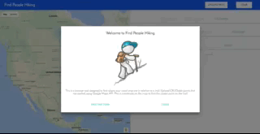

## Find People Hiking

[This](https://tchesnutt.github.io/find-people-hiking/) is a tool to find how far your loved ones are from a trail (using the Haversine formula). Trail data can only be used if in JSON. Users can CRUD points on a trail. Everything is stored in browser so refreshing will wipe all data. To test the app, the Pacific Coast Trail is provided as default. The user interface is all MaterialUI.

