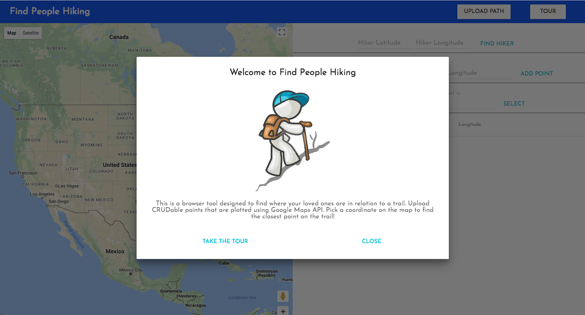

## Find People Hiking
<hr>


[Live](https://tchesnutt.github.io/find-people-hiking/)

This is a tool to find out how much your loved ones have deviated from a trail. Trail data can only be used if in JSON. Users can CRUD points on a trail. Everything is stored in browser so refreshing will wipe all data. To test the app, the Pacific Coast Trail is provided as default. The user interface is all MaterialUI.
<hr>

### Implementation
####  The Data Table
In order to edit any uploaded points it helps to be able to see them, hence the need for a data table. Initially, the largest constraint I encountered was the big volume of data (users's could upload a path with tens of thousands of points). You can't just display a table that long in a browser. Thus, I needed to implement bounds to the data which would be displayed.

```javascript
  grabView(start, end) {
    //initialize a new array
    this.state.view = [];
    //iterate through the data and put all points in if they were between the bounds
    this.state.data.forEach( (el, i) => {
      if(i <= end && i >= start){
        let newEl;
        newEl = el;
        this.state.view.push(newEl)
      }
    });
  }
```

Creating and Updating points where handled by Modals with forms in them. I did this too keep the UI less cluttered. The neatest part about this process was parsing the data for either finding a specific point or inputing a new point. I did this with bsearch:

```javascript
  bsearch(newMile){
    let data = this.state.data;
    let minIdx = 0;
    let maxIdx = data.length - 1;
    let currentIdx;
    let currentEl;
    if(newMile > data[maxIdx].id){
      return maxIdx;
    }
    while(minIdx <= maxIdx){
      currentIdx = (minIdx + maxIdx) / 2 | 0;
      currentEl = data[currentIdx];
      if(currentEl.id < newMile) {
        minIdx = currentIdx + 1;
      } else if (currentEl.id > newMile) {
        maxIdx = currentIdx - 1;
      } else {
        return currentIdx;
      }
    }
    return maxIdx + 1;
  }
```

#### The Map
First off, let me say, there is a better way of doing this, I'll get to that later. When writing this component, I had trouble navigating the inflexiblity of the google maps wrapper I was using `react-google-maps`. My render function turned into a very big if else conditional. Here's an abriged version:
```javascript
render(){
  const GettingGoogleMap = withGoogleMap(props => {
    //if user has not dropped a hiker pin and has no path
    if((isLine === false) && (isPath === false)) {
      return(
        ...
      );
      //if user uploaded a path but no hiker pin
    } else if((isLine === false) && (isPath === true)) {
      return(
        ...
      )
      //if user uploaded a path and hiker pin
    } else if((isLine === true) && (isPath === true)) {
      return(
        ...
      )
    }
  });
  return(
    <div className="second-step">
      //return the generated map
      <GettingGoogleMap/>
    </div>
  )
}
```
A huge negative of the way I'm doing this, is that any change in state triggers a rerendering of the map. Rerendering is not such a big deal normally, but Google Maps are big things, with a lot of moving pieces. Each of the rerenders I do takes almost a second. It's annoying to use. I know, moving forward, there must be a way to just render the map once and then make changes to it. I might have to not use the wrapper I'm using and just do it myself.
